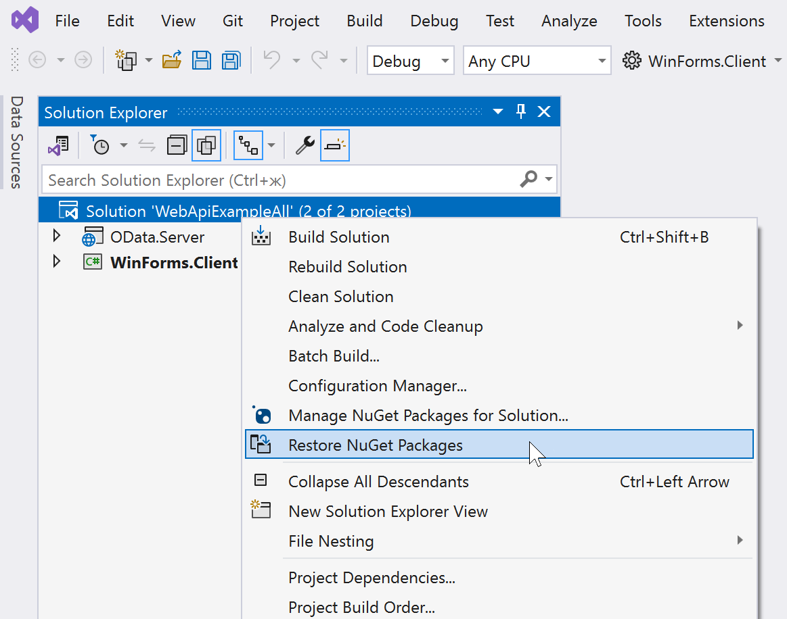
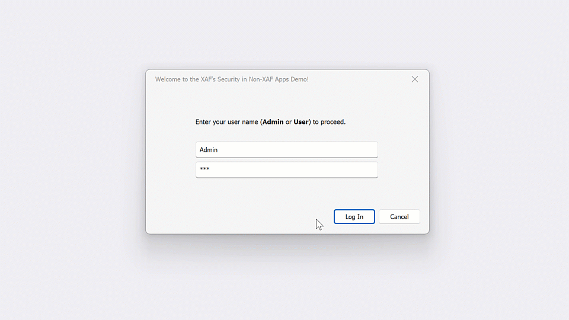

<!-- default badges list -->

<!-- default badges end -->
# Connect the WinForms Data Grid to a Secure Backend with the DevExpress Web API Service (EF Core with OData)

The following example demonstrates the following:

1.	How to build a data model for application business entities and security policies with EF Core.
2.	How to securely load data from OData endpoints to a WinForms UI client using the [DevExpress WinForms Data Grid](https://www.devexpress.com/products/net/controls/winforms/grid/) control.
3.	How to activate authentication and authorization for the WinForms application using custom Web API endpoints (powered by the [DevExpress Backend Web API Service](https://docs.devexpress.com/eXpressAppFramework/403394/backend-web-api-service)).
4.	How to create a login form and customize its user interface elements based on access permissions.

## Getting Started

1.	Open *WebApiExampleAll.sln*. [Register a DevExpress NuGet feed](https://docs.devexpress.com/GeneralInformation/116698/nuget/setup-visual-studios-nuget-package-manager) in the Visual Studio IDE. Skip this step if you have already registered the DevExpress NuGet feed.
2.	Restore NuGet packages in the solution:

    
3.	Run the **OData.Server** project. Right-click OData.Server in the Solution Explorer and select **Debug** | **Start New Instance** in the menu. Your default web browser will open. Starting the Web API server for the first time can take up to 20 seconds.
    
    > **IMPORTANT**
    > 
    > Do not close the web browser.
4.	Run the **WinForms.Client** project. Right-click OData.Server in the Solution Explorer and select **Debug** | **Start New Instance** in the menu.
5.	Click "Log in" to proceed. The password for **Admin** and **User** accounts is "QQQ". You can sort, filter, and group grid rows (records) as needed. Double-click a grid row to open the edit form and modify cell values:
    
    

## See Also
* [A Related Blog Post (general motivation, future considerations, etc.)](https://community.devexpress.com/blogs/winforms/archive/2024/07/18/winforms-connect-a-net-desktop-client-to-a-secure-backend-with-the-devexpress-web-api-service-ef-core-with-odata.aspx)
* [JavaScript with DevExtreme + ASP.NET Core Web API/OData App](https://github.com/DevExpress-Examples/XAF_Security_E4908/tree/23.2.4+/EFCore/ASP.NetCore/DevExtreme.OData)
* [JavaScript with Svelte + ASP.NET Core Web API/OData App](https://github.com/oliversturm/demo-dx-webapi-js/tree/stage-4)
* [Blazor WebAssembly App](https://github.com/DevExpress-Examples/XAF_Security_E4908/tree/23.2.4%2B/EFCore/ASP.NetCore/Blazor.WebAssembly)
* [.NET MAUI (iOS/Android) App](https://github.com/DevExpress-Examples/XAF_Security_E4908/tree/23.2.4%2B/EFCore/MAUI)
<!-- feedback -->
## Does this example address your development requirements/objectives?

 

(you will be redirected to DevExpress.com to submit your response)
<!-- feedback end -->
